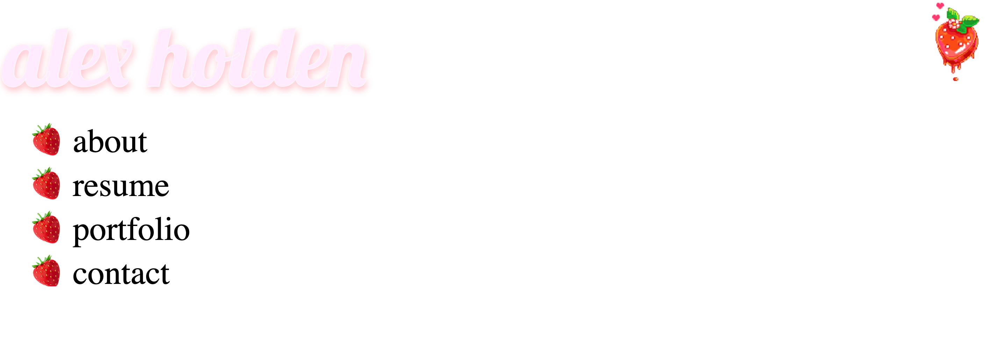
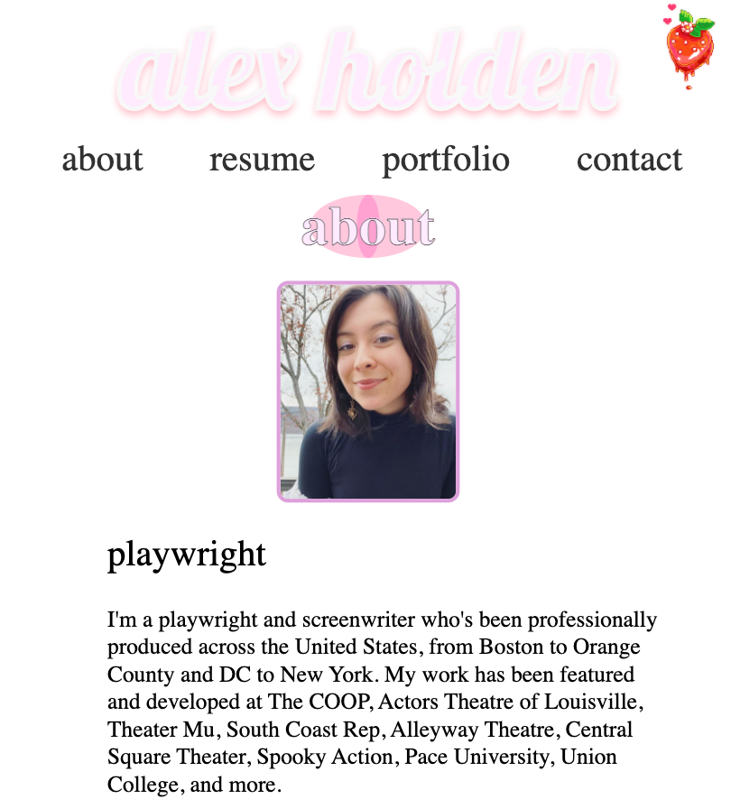

  🌸 hey there! 🌸 

  welcome to my professional portfolio repo.

  here's the work i've done for the uc berkley coding bootcamp's module 2 challenge assignment. in this challenge, i was tasked with: 

🍓 coding and designing a professional portfolio page from scratch 
🍓 ensuring that users could successfully access my deployed projects 
🍓 adding a little personality for spice 

  here are some screenshots of my work: 
  

  you can deploy the content yourself at the <a href="https://descardi-b.github.io/professional-portfolio/">gitpages link here</a>

